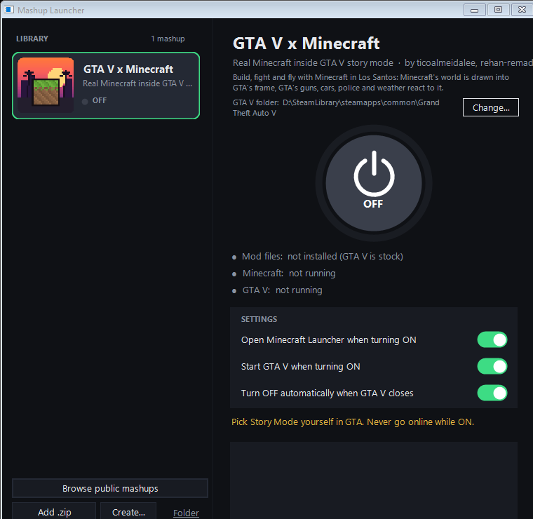
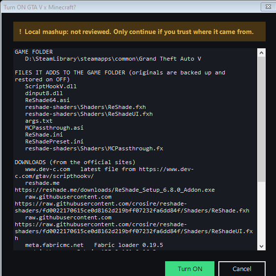

# Mashup Launcher

**Play two games as one.** Mashup Launcher is a small Windows app that installs game mashups (Minecraft inside GTA V,
and whatever the community builds next), turns them ON with one button, and turns them OFF again leaving your games
exactly as they were.

<p align="center"></p>

- **A library.** Browse reviewed public mashups, add a `.zip` someone shared, or create your own.
- **Your games, found for you.** It finds Steam games by itself; otherwise you point it at the game's folder once.
- **One button.** ON installs the mashup and starts both games. OFF closes them and removes every file it added.
- **Nothing left behind.** Every file is recorded before it is written; anything a mashup replaces is backed up and put
  back. If an install fails halfway, it undoes itself.
- **You see everything first.** Before anything is installed, a trust screen lists every file, every download and where
  it comes from, and whether the mashup was reviewed.
- **Runs on your PC only.** Portable: unzip it anywhere. No account, no server, no telemetry. It only goes online when you
  install something.

## Get it

1. Download `MashupLauncher-<version>.zip` from [Releases](../../releases) and unzip it anywhere.
2. Run `MashupLauncher.exe` (Windows 10/11; .NET Framework 4.8 is built in).
3. **Browse public mashups**, install one, pick it in the library, press the power button.

## Mashups

| mashup | what it is |
|---|---|
| [GTA V x Minecraft](mashups/gta-minecraft) | Real Minecraft inside GTA V story mode: build in Los Santos, Minecraft weapons with GTA effects, GTA guns in Minecraft hands, survival with GTA's police, elytra flight, every Minecraft key from GTA. |

## Making a mashup

A mashup is a folder with a `mashup.json` that says which game it goes into, which files it adds, what it downloads
(from official sites), and how to start the games. See [docs/mashup-format.md](docs/mashup-format.md).

The fastest way to start: **Create...** in the launcher. Pick the two games' folders and it makes a draft mashup with a
`PROMPT.md` for [universal-modder](https://github.com/rehan-remade/universal-modder), the AI toolkit that does the actual
modding (Claude Code, Codex, Cursor and others can run it). When your mashup works, share the zip, or submit it to the
public library: [library/README.md](library/README.md).

## Safety

Mashups are code that runs on your PC, so the launcher is strict about what it lets them do:

<p align="center"></p>

- Files only ever go into the game folder you picked; a mashup can't write anywhere else (paths are checked, and zips
  that try to escape their folder are rejected).
- Public mashups are reviewed before they are listed, and their downloads are checked against a SHA-256 in the index.
  Mashups you add yourself are marked **not reviewed**.
- Games with anti-cheat are refused unless the mashup says how it keeps the game offline, and the trust screen shows it.
  Mashups are for single-player and offline play. Never take a modded game online.
- Nothing from a game is redistributed, and third-party tools whose licence forbids redistribution are downloaded from
  their official sites at install time.

Found a security problem? See [SECURITY.md](SECURITY.md).

## Building

```bat
launcher\build.bat        :: builds MashupLauncher.exe (Roslyn from Visual Studio Build Tools)
test.bat                  :: builds it and runs the self-tests
```

Headless: `MashupLauncher.exe --list | --add package.zip | --on [id] | --off [id] | --status [id] | --choose id folder`.
Each mashup has its own build instructions in its folder. CI (`.github/workflows/build.yml`) builds and tests everything
on Windows and publishes releases from `v*` tags.

## Credits

The GTA V x Minecraft mashup builds on [rehan-remade/universal-modder](https://github.com/rehan-remade/universal-modder)'s
MIT-licensed passthrough example. See [NOTICE.md](NOTICE.md) for all credits and licences. Minecraft and GTA V belong to
their owners; this is a fan project, not affiliated with Mojang, Microsoft, Rockstar Games or Take-Two.

MIT licensed.
